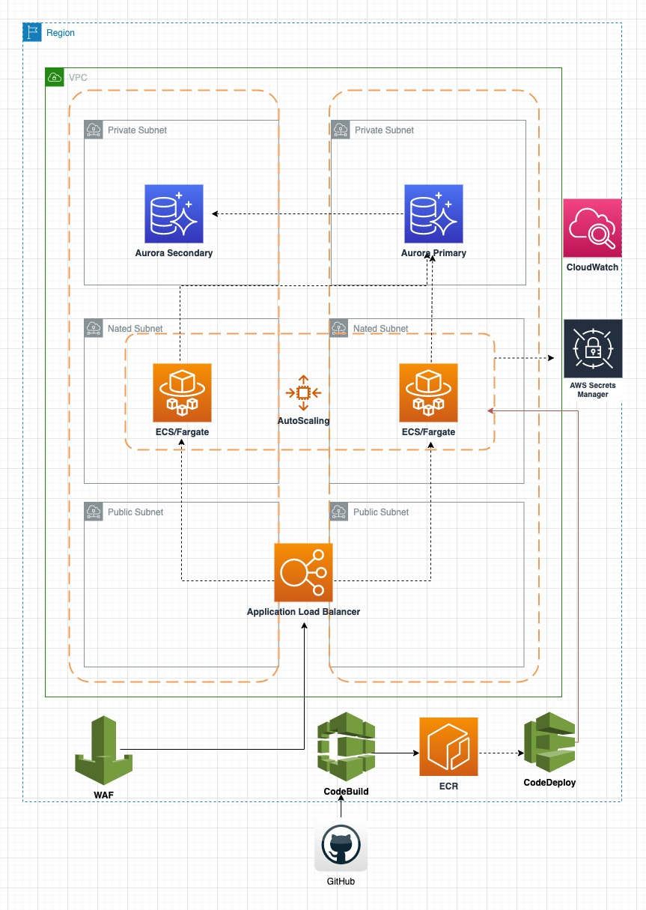

# README #

# Introduction #
This Souion build simple Project test the DB connectivity,
The application Code writtin using go lanugauge & Infrastracture as code using Terrafrom.

The Terraform Code will create the Follwing Resources :


* **VPC**
    * **Public Subnets** that's associated with a route table that has a route to an internet gateway. 
    * **Private Subnets**  that's associated with a route table that has a route to Local Network (VPC)
    * **Nated Subnets** that's associated with a routeing table with a route to a Nat gateway.
* **Application Load Balancer** to split the traffic between the ECS/Faragte Services
* **AWS WAF** firewall associated with the ALB to help protect common web exploits and bots that may affect availability, compromise security.
* **AWS Aurora** MYSQ Cluster will host the DB with primary and secondry DB for high avaliblilty
* **ECS/FARGATE** to run containers without having to manage servers or clusters
* **AWS ECR** Private container image registry to host our docker image
* **AWS Secrets Manager**will use to host the DB URL that contains sensitive like DB credentials
* **CloudWatch** will be used to monitor the cluster using Container Insights and collect the logs
* **AWS CodePipeline** CI/CD Pipeline has the following stages
    * **Source Stage**:
    1. The application source code is maintained in a repository configured as a GitHub source action in the pipeline. any push commits to the repository, CodePipeline detects the pushed change, and a pipeline execution starts from the Source Stage.
    2. The GitHub source action completes successfully (that is, the latest changes have been downloaded and stored to the artifact bucket unique to that execution). The output artifacts produced by the GitHub source action, which are the application files from the repository, are then used as the input artifacts to be worked on by the actions in the next stage.
    * **Build Stage** 
      1. The pipeline execution transitions from the Source Stage to the Build Stage. The first action in the Build Stage runs a build project created in CodeBuild and configured as a build action in the buildspec.yaml. The build task pulls a build environment image and builds the docker image in a virtual container.
      2. CodeBuild will create a new build artifacts that contanis the new version of the task definition
    * **Deploy Stage** The Pipline will deploy the latest image that was created from the build step to the ecs servics.

## Solution Design:



## Usage

This terraform use S3 as backend for terraform state 
  1. Update the `backend.tf`  
```terraform
terraform {
  backend "s3" {
    encrypt = true
    bucket  = "your-backet-name"
    key     = "terraform.tfstate"
    region  = "your-bucket-region"
  }
}
```

2. Update the AWS Account ID in `buildspec.yaml` file

3. Run the terraform init command to initialize a working directory that contains a Terraform configuration
```
terraform init
```
4. The terraform plan command evaluates a Terraform configuration to determine the desired state of all the resources it declares, then compares that desired state to the real infrastructure objects being managed with the current working directory and workspace
```
terraform plan
```
5. The terraform apply command performs a plan just like terraform plan does, but then actually carries out the planned changes to each resource using the relevant infrastructure provider's API. It asks for confirmation from the user before making any changes, unless it was explicitly told to skip approval.
```
terraform apply
```
6. After finishing, you will have the below results
```
Apply complete!  

terraform output
````

7. You need to go to AWS Pipline service from AWS console to edit the Github connection to make it AVAILABLE
https://docs.aws.amazon.com/dtconsole/latest/userguide/connections-create-github.html

8. Release the pipline and wait untill pipline finish to test the code :)

<!-- BEGIN_TF_DOCS -->
## Requirements

| Name | Version |
|------|---------|
| <a name="requirement_aws"></a> [aws](#requirement\_aws) | ~> 4.0 |

## Providers

| Name | Version |
|------|---------|
| <a name="provider_aws"></a> [aws](#provider\_aws) | 4.22.0 |

## Modules

| Name | Source | Version |
|------|--------|---------|
| <a name="module_cluster"></a> [cluster](#module\_cluster) | terraform-aws-modules/rds-aurora/aws | 7.2.1 |

## Resources

| Name | Type |
|------|------|
| [aws_appautoscaling_policy.ecs_target_cpu](https://registry.terraform.io/providers/hashicorp/aws/latest/docs/resources/appautoscaling_policy) | resource |
| [aws_appautoscaling_policy.ecs_target_memory](https://registry.terraform.io/providers/hashicorp/aws/latest/docs/resources/appautoscaling_policy) | resource |
| [aws_appautoscaling_target.ecs_target](https://registry.terraform.io/providers/hashicorp/aws/latest/docs/resources/appautoscaling_target) | resource |
| [aws_cloudwatch_log_group.logs](https://registry.terraform.io/providers/hashicorp/aws/latest/docs/resources/cloudwatch_log_group) | resource |
| [aws_codebuild_project.repo-project](https://registry.terraform.io/providers/hashicorp/aws/latest/docs/resources/codebuild_project) | resource |
| [aws_codepipeline.pipeline](https://registry.terraform.io/providers/hashicorp/aws/latest/docs/resources/codepipeline) | resource |
| [aws_codestarconnections_connection.qureos-prod](https://registry.terraform.io/providers/hashicorp/aws/latest/docs/resources/codestarconnections_connection) | resource |
| [aws_ecr_repository.ecr-repo](https://registry.terraform.io/providers/hashicorp/aws/latest/docs/resources/ecr_repository) | resource |
| [aws_ecs_cluster.ecs-cluster](https://registry.terraform.io/providers/hashicorp/aws/latest/docs/resources/ecs_cluster) | resource |
| [aws_ecs_service.svc](https://registry.terraform.io/providers/hashicorp/aws/latest/docs/resources/ecs_service) | resource |
| [aws_ecs_task_definition.task](https://registry.terraform.io/providers/hashicorp/aws/latest/docs/resources/ecs_task_definition) | resource |
| [aws_eip.nat](https://registry.terraform.io/providers/hashicorp/aws/latest/docs/resources/eip) | resource |
| [aws_iam_role.codebuild-role](https://registry.terraform.io/providers/hashicorp/aws/latest/docs/resources/iam_role) | resource |
| [aws_iam_role.ecs-autoscale-role](https://registry.terraform.io/providers/hashicorp/aws/latest/docs/resources/iam_role) | resource |
| [aws_iam_role.ecs-task](https://registry.terraform.io/providers/hashicorp/aws/latest/docs/resources/iam_role) | resource |
| [aws_iam_role.pipeline_role](https://registry.terraform.io/providers/hashicorp/aws/latest/docs/resources/iam_role) | resource |
| [aws_iam_role_policy.codebuild-policy](https://registry.terraform.io/providers/hashicorp/aws/latest/docs/resources/iam_role_policy) | resource |
| [aws_iam_role_policy_attachment.ExecutionRole_to_ecsTaskExecutionRole](https://registry.terraform.io/providers/hashicorp/aws/latest/docs/resources/iam_role_policy_attachment) | resource |
| [aws_iam_role_policy_attachment.ecs-autoscale](https://registry.terraform.io/providers/hashicorp/aws/latest/docs/resources/iam_role_policy_attachment) | resource |
| [aws_internet_gateway.i-gateway](https://registry.terraform.io/providers/hashicorp/aws/latest/docs/resources/internet_gateway) | resource |
| [aws_lb.app-lb](https://registry.terraform.io/providers/hashicorp/aws/latest/docs/resources/lb) | resource |
| [aws_lb_listener.lb-listener](https://registry.terraform.io/providers/hashicorp/aws/latest/docs/resources/lb_listener) | resource |
| [aws_lb_target_group.tg-group](https://registry.terraform.io/providers/hashicorp/aws/latest/docs/resources/lb_target_group) | resource |
| [aws_nat_gateway.gw](https://registry.terraform.io/providers/hashicorp/aws/latest/docs/resources/nat_gateway) | resource |
| [aws_route.nated-route](https://registry.terraform.io/providers/hashicorp/aws/latest/docs/resources/route) | resource |
| [aws_route.pub-route](https://registry.terraform.io/providers/hashicorp/aws/latest/docs/resources/route) | resource |
| [aws_route_table.nated-table](https://registry.terraform.io/providers/hashicorp/aws/latest/docs/resources/route_table) | resource |
| [aws_route_table.private-table](https://registry.terraform.io/providers/hashicorp/aws/latest/docs/resources/route_table) | resource |
| [aws_route_table.pub-table](https://registry.terraform.io/providers/hashicorp/aws/latest/docs/resources/route_table) | resource |
| [aws_route_table_association.as-nated](https://registry.terraform.io/providers/hashicorp/aws/latest/docs/resources/route_table_association) | resource |
| [aws_route_table_association.as-private](https://registry.terraform.io/providers/hashicorp/aws/latest/docs/resources/route_table_association) | resource |
| [aws_route_table_association.as-pub](https://registry.terraform.io/providers/hashicorp/aws/latest/docs/resources/route_table_association) | resource |
| [aws_s3_bucket.bucket-artifact](https://registry.terraform.io/providers/hashicorp/aws/latest/docs/resources/s3_bucket) | resource |
| [aws_s3_bucket_acl.example_bucket_acl](https://registry.terraform.io/providers/hashicorp/aws/latest/docs/resources/s3_bucket_acl) | resource |
| [aws_secretsmanager_secret.rds](https://registry.terraform.io/providers/hashicorp/aws/latest/docs/resources/secretsmanager_secret) | resource |
| [aws_secretsmanager_secret_version.rds](https://registry.terraform.io/providers/hashicorp/aws/latest/docs/resources/secretsmanager_secret_version) | resource |
| [aws_security_group.ecs-alb](https://registry.terraform.io/providers/hashicorp/aws/latest/docs/resources/security_group) | resource |
| [aws_security_group.ecs-sg](https://registry.terraform.io/providers/hashicorp/aws/latest/docs/resources/security_group) | resource |
| [aws_subnet.nated-subnets](https://registry.terraform.io/providers/hashicorp/aws/latest/docs/resources/subnet) | resource |
| [aws_subnet.private-subnets](https://registry.terraform.io/providers/hashicorp/aws/latest/docs/resources/subnet) | resource |
| [aws_subnet.pub-subnets](https://registry.terraform.io/providers/hashicorp/aws/latest/docs/resources/subnet) | resource |
| [aws_vpc.ecs-vpc](https://registry.terraform.io/providers/hashicorp/aws/latest/docs/resources/vpc) | resource |
| [aws_wafv2_web_acl.wafv2](https://registry.terraform.io/providers/hashicorp/aws/latest/docs/resources/wafv2_web_acl) | resource |
| [aws_wafv2_web_acl_association.waf-alb](https://registry.terraform.io/providers/hashicorp/aws/latest/docs/resources/wafv2_web_acl_association) | resource |

## Inputs

| Name | Description | Type | Default | Required |
|------|-------------|------|---------|:--------:|
| <a name="input_app"></a> [app](#input\_app) | Project Name | `string` | `"go-project"` | no |
| <a name="input_azs"></a> [azs](#input\_azs) | List of avalibilty zone | `list(string)` | <pre>[<br>  "us-east-1a",<br>  "us-east-1b"<br>]</pre> | no |
| <a name="input_branch_name"></a> [branch\_name](#input\_branch\_name) | Branch Name | `string` | `"main"` | no |
| <a name="input_build_project"></a> [build\_project](#input\_build\_project) | Build Project Name | `string` | `"Go-Project"` | no |
| <a name="input_buildspec"></a> [buildspec](#input\_buildspec) | collection of build commands and related settings, in YAML format, that CodeBuild uses to run a build | `string` | `"buildspec.yml"` | no |
| <a name="input_cidr"></a> [cidr](#input\_cidr) | VPC CIDR | `string` | `"145.0.0.0/16"` | no |
| <a name="input_db_password"></a> [db\_password](#input\_db\_password) | RDS Password | `string` | n/a | yes |
| <a name="input_db_user"></a> [db\_user](#input\_db\_user) | RDS User | `string` | n/a | yes |
| <a name="input_logs_retention_in_days"></a> [logs\_retention\_in\_days](#input\_logs\_retention\_in\_days) | Specifies the number of days you want to retain log events | `number` | `90` | no |
| <a name="input_nated-subnets-ip"></a> [nated-subnets-ip](#input\_nated-subnets-ip) | Nated Subnets CIDR | `list(string)` | <pre>[<br>  "145.0.3.0/24",<br>  "145.0.4.0/24"<br>]</pre> | no |
| <a name="input_port"></a> [port](#input\_port) | container port | `string` | 3000 | no |
| <a name="input_private-subnets-ip"></a> [private-subnets-ip](#input\_private-subnets-ip) | Private Subnets CIDR | `list(string)` | <pre>[<br>  "145.0.5.0/24",<br>  "145.0.6.0/24"<br>]</pre> | no |
| <a name="input_public-subnets-ip"></a> [public-subnets-ip](#input\_public-subnets-ip) | Public Subnets CIDR | `list(string)` | <pre>[<br>  "145.0.1.0/24",<br>  "145.0.2.0/24"<br>]</pre> | no |
| <a name="input_repo_name"></a> [repo\_name](#input\_repo\_name) | Repositery Name | `string` | `"OneFootball-Hiring/cloud-assignment-hamzeh-shaghlil/"` | no |

## Outputs

| Name | Description |
|------|-------------|
| <a name="output_alb_dns"></a> [alb\_dns](#output\_alb\_dns) | LoadBalancer Endpoint |
<!-- END_TF_DOCS -->


## Author
* **Hamzeh Shaghlil** - [Linkedin](https://www.linkedin.com/in/hamzeh-shaghlil
)
